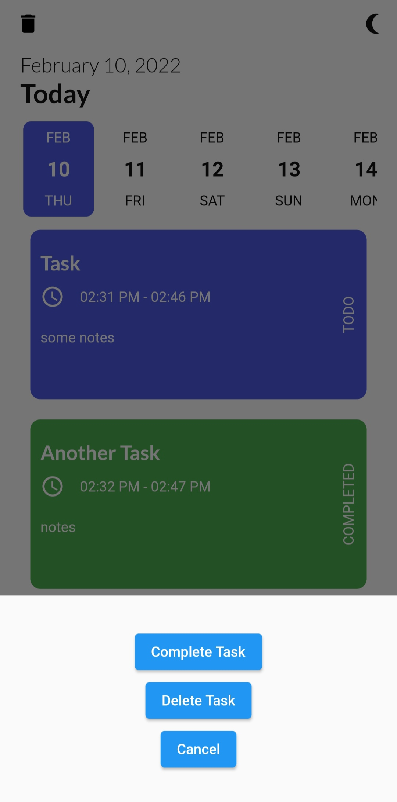

# time_do

A  TODO Flutter project.

## Getting Started
Flutter application

-Design Pattern : MVC
-Database(local) : SQFLite
-State Managament : GETX

Features :
-Dark Mode
-Local Notifications

Screenshots:

A few resources to get you started if this is your first Flutter project:

- [Lab: Write your first Flutter app](https://flutter.dev/docs/get-started/codelab)
- [Cookbook: Useful Flutter samples](https://flutter.dev/docs/cookbook)

For help getting started with Flutter, view our
[online documentation](https://flutter.dev/docs), which offers tutorials,
samples, guidance on mobile development, and a full API reference.
